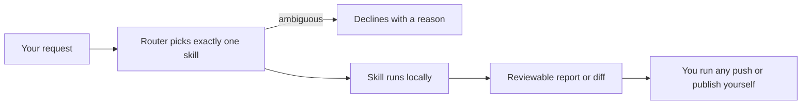

<p align="center">
  
</p>

# ReleaseBench

[](https://gitlab.com/krahul02004/ReleaseBench/-/commits/main)
[](https://pypi.org/project/releasebench/)
[](LICENSE)

ReleaseBench is a Claude Code plugin for developers who are about to take a private repository
public. Its ten focused skills handle the risky steps of that move (auditing repository health,
scanning for committed secrets, generating the standard public-repo files, polishing the README, and
preparing releases), and each one stops at a result you can review, never a push or publish it
performs on its own. Without checks like these, mistakes become public the moment the repository
does: a committed API key, a missing license, or an untested install command ships to the world in
one push.

## Getting started

**Prerequisites:** Python 3.10+ (standard library only) for the CLI, Node 18+ to run the bundled
audit and secret scripts directly, and Claude Code to use ReleaseBench as a plugin.

**Install:**

- In Claude Code (one command): `/plugin marketplace add https://gitlab.com/krahul02004/ReleaseBench`
  then `/plugin install releasebench`. That reads the self-hosted marketplace manifest committed in
  this repository (`.claude-plugin/marketplace.json`); nothing is published to an external or central
  registry.
- Python CLI: `pip install releasebench`.

**Check it works:** hand the router one typed request and read the single-line receipt it prints
(write the file with plain `Set-Content` so no byte-order mark is added):

```powershell
'{"contract_version":"releasebench.route-request/v1","request_id":"getting-started","intents":["audit-repository"]}' |
  Set-Content request.json
releasebench request.json
```

<details>
<summary>Exact one-line receipt</summary>

```text
{"authority_state":"candidate-inactive","closed_actions":["remote-project-creation-and-first-push","host-visibility-metadata-topics-avatar-writes","host-public-api-and-network-verification","local-tag-creation-and-outward-tag-push","host-release-creation-or-backfill","package-registry-name-availability-reads","package-publication","remote-image-reachability-checks"],"considered_leaves":["releasebench-audit-repository"],"decision":"selected","leaf_id":"releasebench-audit-repository","outward_actions_authorized":false,"outward_actions_executed":false,"reason_code":"ONE_DIRECT_INTENT","receipt_sha256":"c6bf6d7d150da84b8f5870e3aac9bba4504700e088dfdd37c0a609b34c4d5b35","receipt_version":"releasebench.route-receipt/v1","request_id":"getting-started","router_id":"releasebench-route","visibility_state":"private-prepublic"}
```

</details>

The `"decision":"selected"` and `"leaf_id":"releasebench-audit-repository"` fields confirm the router
is installed and routing. The detailed demos below explain the receipt in full.

## The 30-second demo

At the center of ReleaseBench is a small deterministic router. You hand it a typed JSON request
saying what you want; it answers with exactly one skill to run, or refuses when the request is
ambiguous. After [installing](#install) (`pip install releasebench`):

```powershell
'{"contract_version":"releasebench.route-request/v1","request_id":"demo-1","intents":["scan-secrets"]}' |
  Set-Content request.json
releasebench request.json
```

<details>
<summary>Exact one-line receipt</summary>

```text
{"authority_state":"candidate-inactive","closed_actions":["remote-project-creation-and-first-push","host-visibility-metadata-topics-avatar-writes","host-public-api-and-network-verification","local-tag-creation-and-outward-tag-push","host-release-creation-or-backfill","package-registry-name-availability-reads","package-publication","remote-image-reachability-checks"],"considered_leaves":["releasebench-scan-secrets"],"decision":"selected","leaf_id":"releasebench-scan-secrets","outward_actions_authorized":false,"outward_actions_executed":false,"reason_code":"ONE_DIRECT_INTENT","receipt_sha256":"bbe6cc0ae3ae305bdb5c134521fae0b8d745f6777784b54aabcc3d8bdfbd93ef","receipt_version":"releasebench.route-receipt/v1","request_id":"demo-1","router_id":"releasebench-route","visibility_state":"private-prepublic"}
```

</details>

That one-line answer is a **receipt**: a JSON record of what was decided and why. `leaf_id` is the
one skill it chose (the router calls skills "leaves"), `reason_code` says why, `closed_actions`
lists everything it refused to even consider doing (every push, tag, publish, and settings change),
and `receipt_sha256` is a checksum of the record itself. The same request always produces
byte-identical output, which is what the test suite verifies.

## What's inside

Ten skills. Each does one job and hands you something you can read before anything else happens.

| Skill | What you get |
|---|---|
| `releasebench-route` | Picks the one right skill for your request, or tells you clearly that no safe choice exists. |
| `releasebench-prepare-repository` | Runs the full local preparation pass (audit, secret scan, missing standard files, config docs) and summarizes the result. |
| `releasebench-audit-repository` | A read-only report of which files a public repo needs are present or missing, by severity. |
| `releasebench-scan-secrets` | A read-only scan for committed keys, tracked `.env` files, and `.gitignore` gaps. Findings are masked, never printed in full. |
| `releasebench-scaffold-governance` | Ready-to-review drafts of only the files you are missing: LICENSE, CONTRIBUTING, SECURITY, CODE_OF_CONDUCT, CHANGELOG, issue and PR templates. |
| `releasebench-showcase-readme` | A truthful README makeover (badges, demo, architecture diagram) with no invented metrics. |
| `releasebench-publish-repository` | A step-by-step handoff for creating the remote project and going public: commands prepared for you to run, never run for you. |
| `releasebench-release-version` | A prepared version release (changelog cut, version bump, and the exact tag and Release commands), ready for your approval. |
| `releasebench-prepare-package` | An offline dry run showing exactly what would ship to npm or PyPI before you publish. |
| `releasebench-document-config` | A JSON Schema, a validator, and "make it yours" docs for your config file, generated together so they cannot drift apart. |

## How it works

1. You ask for something: "get this repo ready to go public", "check for leaked keys".
2. The router picks exactly one skill, or declines with a reason rather than guessing.
3. The chosen skill runs locally and stops at a reviewable result: a report, a diff, or prepared
   commands.
4. Anything that would leave your machine (pushing, tagging, creating a release, changing project
   settings, publishing a package) is written down for you but left for you to run.



## Run it inside Claude Code

Load the plugin from a checkout:

```powershell
claude.cmd --plugin-dir .
```

Then let the router decide:

```text
/releasebench:releasebench-route
```

Or call one skill directly, for example:

```text
/releasebench:releasebench-scan-secrets
```

Each skill also bundles metadata for OpenAI Codex under `agents/openai.yaml`; automatic invocation
is switched off there, so a skill runs only when you name it.

## No Claude Code? Still useful

A receipt names a skill, and skills are procedures that Claude Code executes, so with the plugin
loaded, the named skill is simply the next thing you run. Without Claude Code, ReleaseBench is two
things: the `releasebench` router CLI shown above, and the bundled scripts under `skills/*/scripts`,
which are plain dependency-free Node programs you can run directly against any repository path.
Here is the repository-health audit pointed at a small demo app that has code and a README but
nothing else:

```powershell
node skills/releasebench-audit-repository/scripts/audit-repo.mjs R:\demo-app
```

```text
[audit-repo] R:\demo-app
present: README, .gitignore

  [MUST] LICENSE: add a license (e.g. MIT); with none, the repo is "all rights reserved"
  [RECOMMENDED] CONTRIBUTING: add CONTRIBUTING: how to contribute + the project guardrails
  [RECOMMENDED] SECURITY: add SECURITY: how to report vulnerabilities privately
  [RECOMMENDED] CODE_OF_CONDUCT: add CODE_OF_CONDUCT: community standards
  [RECOMMENDED] CHANGELOG: add CHANGELOG: notable changes
  [RECOMMENDED] issue templates: add .github/ISSUE_TEMPLATE/
  [RECOMMENDED] PR template: add .github/PULL_REQUEST_TEMPLATE.md
  [RECOMMENDED] CI: add a .github/workflows CI (e.g. run tests on push/PR)
  [RECOMMENDED] package.json "license": add a "license" field
  [INFO] secrets scan: run releasebench-scan-secrets for committed-secret risks
  [INFO] config schema: if there is a JSON config, run releasebench-document-config for a schema + validator + Make-it-yours

summary: 1 must-have missing, 8 recommended missing, 2 present.
Run releasebench-scaffold-governance to generate the missing files.
```

It exits non-zero when a must-have is missing, so it can guard a CI job. The secret scanner
(`skills/releasebench-scan-secrets/scripts/scan-secrets.mjs`) works the same way and masks every
value it finds, printing at most the first three and last two characters.

## Install

The router is on PyPI, with no dependencies beyond the Python 3.10+ standard library:

```powershell
pip install releasebench
```

Usage: `releasebench [-h | --help] [REQUEST_FILE]` reads one typed JSON routing request from
`REQUEST_FILE` (or from stdin when the argument is omitted or `-`) and writes one single-line JSON
receipt to stdout. Exit code 0 means a receipt was written (including "no safe route" answers),
and exit code 2 means the request itself was malformed, with the reason on stderr. The file argument
is the most reliable path on Windows. One caution for Windows PowerShell 5.1: write the request file
with plain `Set-Content` as shown above: both `>` redirection and `-Encoding UTF8` prepend a
byte-order mark, which the router rejects with an `INVALID_JSON ... utf-8-sig` error.

Equivalently, run `python -m releasebench`. To install from a checkout instead: `pip install .`.

## Honest status

ReleaseBench is new: no download counts, no stars, no users to quote. What it has is proof you can
re-run yourself in about a minute:

```powershell
python -B tests/releasebench/run_tests.py
node --test tests/releasebench/test_node_tools.mjs
```

```text
releasebench-atomic-tests tests=22 failures=0 errors=0 skipped=0
candidate_root=.
PASS
```

The Node runner reports 2 tests passed, 0 failed. Those 24 checks (22 Python contracts plus 2 Node
tool regressions) pin down the exact set of skills, every routing decision (including every
pairwise ambiguous request failing safely), byte-identical CLI output, and a privacy check that
forbids machine-specific paths and secret-shaped strings throughout the product files and tests.
GitLab CI runs the same suite on every push (badge above), and the PyPI package was re-installed
into a fresh virtual environment to verify the install command while writing this README.

The repository audit recognizes both GitHub-native (`.github/...`) and GitLab-native
(`.gitlab/...`, `.gitlab-ci.yml`) project surfaces. The Node regression suite exercises both
layouts so a host-specific false warning cannot silently return.

Status in one line: source version `0.1.1` is prepared for review, PyPI still carries `0.1.0`, all
24 checks pass, and no `v0.1.1` tag, GitLab Release, or `0.1.1` publication has occurred; the full
ledger of what ReleaseBench deliberately does not do on its own is in [STATUS.md](STATUS.md).

## Governance

ReleaseBench is available under the [MIT License](LICENSE). Contributions follow
[CONTRIBUTING.md](CONTRIBUTING.md), the [Code of Conduct](CODE_OF_CONDUCT.md), and
[private security reporting guidance](SECURITY.md). Planned work is recorded in
[ROADMAP.md](ROADMAP.md).

Built by Rahul Krishna.
