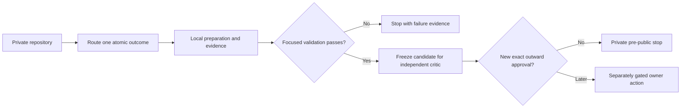

<p align="center">
  
</p>

# ReleaseBench

[](LICENSE)
[](docs/public/READINESS.md)

ReleaseBench is a ten-skill atomic family for taking a private repository to the last
evidence-backed checkpoint before outward publication. It separates local preparation from
owner-gated host, release, registry, marketplace, installation, and public-verification actions.

This repository is a private, inactive candidate. It does not grant lifecycle eligibility.

## Atomic family

| Canonical skill | One measurable outcome |
|---|---|
| `releasebench-route` | Select exactly one next leaf or return no safe route. |
| `releasebench-prepare-repository` | Produce one local repository-preparation receipt. |
| `releasebench-audit-repository` | Produce one read-only repository-health gap report. |
| `releasebench-scan-secrets` | Produce one redacted secret-hygiene risk report. |
| `releasebench-scaffold-governance` | Produce one reviewable missing-governance diff. |
| `releasebench-showcase-readme` | Produce one truthful showcase README diff. |
| `releasebench-publish-repository` | Produce one closed-gate host and first-push handoff receipt. |
| `releasebench-release-version` | Produce one local release-preparation receipt. |
| `releasebench-prepare-package` | Produce one offline package dry-run receipt. |
| `releasebench-document-config` | Produce one aligned schema, validator, and documentation diff. |

The router dispatches only; it contains no leaf procedure. A full-flow request advances to the first
incomplete applicable local stage. Ambiguous intent, missing dependency evidence, stale lifecycle
state, or conflicting state returns a no-safe-route receipt.

The family also retains three internal, non-skill primitives: the shared lesson reader, plugin
manifest, and portable agent guide.

## Evidence, not traction

ReleaseBench has no public usage or download claim yet. Its proof is deliberately local and
reproducible: the focused deterministic suite runs 19 product contracts with zero failures, zero
errors, and zero skips; the plugin manifest validates; the bundled read-only auditor reports zero
missing must-haves; and the Python package builds offline and passes its metadata check. These
checks establish candidate integrity, not host, provider, registry, installation, marketplace, or
public behavior.

## Local validation

The focused deterministic suite verifies:

- exact membership of ten canonical skills and three internal primitives;
- the preserved 49-case eval corpus with per-leaf case IDs;
- every positive trigger, every near miss, and all 36 pairwise direct-intent collisions;
- deterministic typed routing, malformed-request failures, full-flow progression, and byte-equal CLI
  receipts;
- retained support files, secret/private-path boundaries, and all eight closed outward actions.

Run the suite from any checkout:

```powershell
python -B tests/releasebench/run_tests.py
```

The local GitLab CI definition runs this suite plus one syntax check per bundled Node script. Its
job scripts contain no explicit provider, registry, marketplace, publication, or product-remote
command. The runner may still resolve the external floating container images declared by the jobs,
so hosted CI is externally gated, unverified, and not claimed as offline-deterministic evidence. A
full local qualification additionally runs:

```powershell
claude.cmd plugin validate .
git diff --check HEAD
git fsck --strict --no-reflogs
```

Then parse all JSON, run `node --check` on every `.mjs`, and replay the exact staged tree from a
fresh worktree. The producing lane does not self-certify; a fresh independent critic must verify the
frozen bytes before any commit or lifecycle decision. See
[the validation contract](docs/public/VALIDATION.md).

## Flow



## Invocation

Load the local plugin from a clean checkout:

```powershell
claude.cmd --plugin-dir .
```

Invoke the router:

```text
/releasebench:releasebench-route
```

Or invoke one direct leaf, for example:

```text
/releasebench:releasebench-scan-secrets
```

Codex metadata is bundled under each skill's `agents/openai.yaml`, but implicit invocation remains
disabled for this inactive candidate.

## Python package

The deterministic router is also packaged as an installable Python module with no runtime
dependencies beyond the standard library:

```powershell
pip install .
```

The `releasebench` console entry point (equivalently `python -m releasebench` or
`python -B src/releasebench/router.py`) reads one typed JSON routing request from stdin or a file
argument and writes one canonical routing receipt. Installing the package changes no skill lifecycle
state and performs no outward action.

## Source policy

New paths, receipts, invocations, and documentation use canonical IDs only. Installed source skills,
imported packages, remotes, marketplaces, providers, and archives are not modified by this
repository.

## Closed actions

This candidate does not create a remote project, push, fetch, pull, tag, create a host Release,
change visibility or host metadata, call a host/public API, check remote image reachability, query a
registry, authenticate, publish a package, install or promote a skill, contact a provider, or
perform a marketplace action. `releasebench-publish-repository` solely owns the first-host/first-push
handoff but does not execute it.

## Candidate status

The local release candidate is `0.1.0`, matching the plugin manifest, the Python package metadata,
and the changelog. Read [readiness status](docs/public/READINESS.md),
[dependency contract](docs/public/DEPENDENCIES.md), and
[owner handoff](docs/public/OWNER-HANDOFF.md) for the remaining gates. These files are local
preparation artifacts, not proof of any host or public state.

Known limitation: the carried audit helper still checks GitHub-specific issue, pull-request, and CI
paths. It therefore reports three recommended gaps even though this GitLab-oriented repository has
GitLab issue templates, merge-request templates, and a local `.gitlab-ci.yml`. Those findings require
host-aware triage; the helper still correctly reports zero missing must-haves. Host-aware governance
detection remains future work.

## Governance

ReleaseBench is available under the [MIT License](LICENSE). Contributions follow
[CONTRIBUTING.md](CONTRIBUTING.md), the [Code of Conduct](CODE_OF_CONDUCT.md), and
[private security reporting guidance](SECURITY.md). Planned work is recorded in
[ROADMAP.md](ROADMAP.md).

Built by Rahul Krishna.
